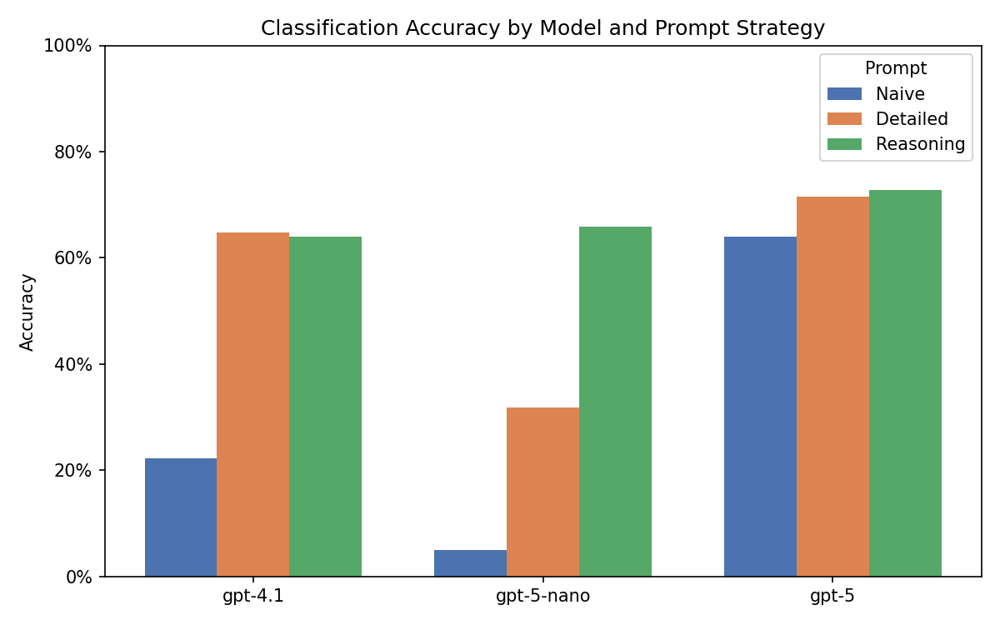
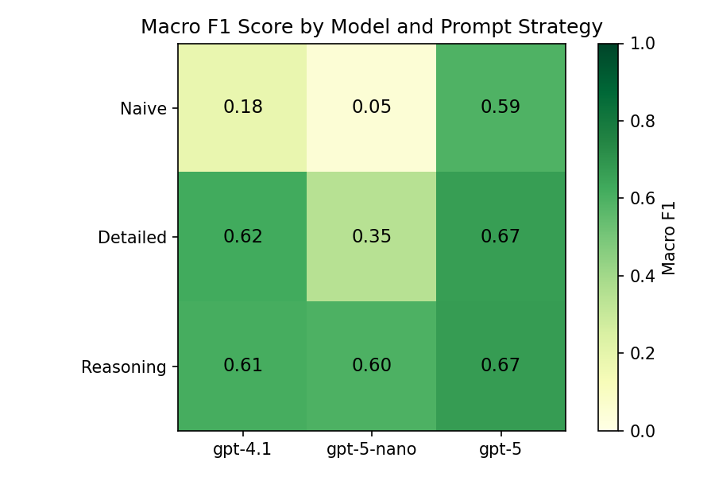
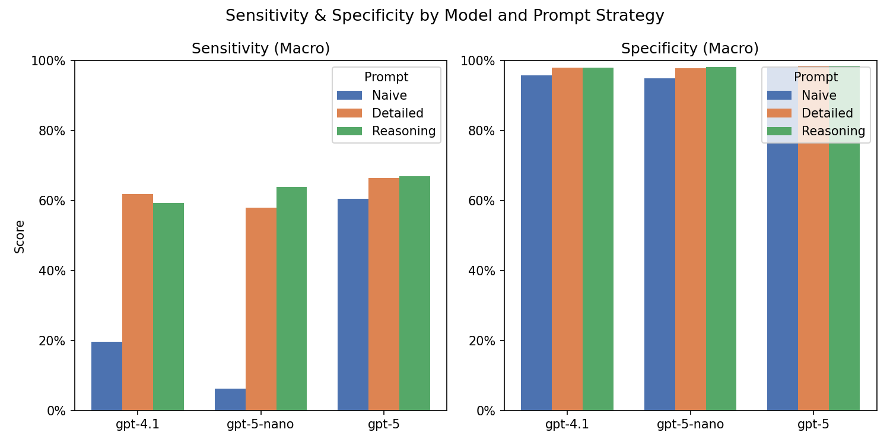

# LLM Evaluation & RAG Tutor Bot

Two components: benchmarking LLMs on a policy classification task, and a RAG-powered course tutor chatbot for INFO 4940/5940 at Cornell.

---

## LLM Policy Classification

Classifies U.S. congressional bill descriptions into one of the 20 major policy topics from the [Comparative Agendas Project (CAP)](https://www.comparativeagendas.net/) using OpenAI batch inference.

### Models benchmarked
| Label | Model ID |
|---|---|
| `gpt-4.1` | gpt-4.1 |
| `gpt-5-nano` | gpt-5-nano |
| `gpt-5` | gpt-5 |

### Prompt strategies
| Label | Description |
|---|---|
| `naive` | Minimal instructions — classify into one of 20 topics |
| `detailed` | Includes all 20 CAP topic codes and descriptions |
| `reasoning` | Chain-of-thought: identify core problem, match to topic, explain choice |

### How it works
- Input: `data/leg_lite.feather` — legislative bill descriptions with ground-truth labels
- Each model × prompt combination is submitted as an OpenAI batch job via [`chatlas`](https://github.com/posit-dev/chatlas) `batch_chat_structured`
- Structured outputs (`PolicyPrediction`) are collected and saved to `data/llm_predictions.csv`
- Batch job state is cached in `data/batch-{model}-{prompt}.json` for resumability

### Results

**Accuracy by model and prompt strategy**


**Macro F1 score heatmap**


**Sensitivity & specificity**


Key findings:
- GPT-5 with reasoning prompt achieved the highest accuracy (72.8%) and macro F1 (0.67)
- Naive prompts hurt smaller models severely — GPT-5-nano naive scored only 5% accuracy
- Detailed and reasoning prompts are comparable for GPT-5; reasoning prompts strongly rescue GPT-5-nano
- Specificity is high (>95%) across all combinations; sensitivity is the harder metric

### Run
```bash
python scripts/leg-label.py
```

---

## RAG Tutor Chatbot

A course tutor chatbot for INFO 4940/5940 built with [Python Shiny](https://shiny.posit.co/py/) and powered by GPT-4.1-mini. Uses Retrieval-Augmented Generation (RAG) over course documents to answer student questions accurately.

### Features
- Answers questions about course concepts, homework, projects, and policies
- Retrieves relevant context from the syllabus and homework PDFs before each response
- Sidebar controls for help mode (concepts, assignments, code, policies) and preferred language (Python/R)
- Enforces academic integrity — guides students rather than giving full solutions

### RAG documents (`rag_docs/`)
- Course syllabus
- Homework assignments HW0–HW6

### Run locally
```bash
shiny run app.py
```

---

## Setup

### Python
```bash
uv sync          # install dependencies from uv.lock
cp .env.example .env  # add your OPENAI_API_KEY
```

### Environment variables
| Variable | Description |
|---|---|
| `OPENAI_API_KEY` | Required for both exercises |

---

## Project structure
```
├── app.py                  # Shiny tutor chatbot
├── scripts/
│   └── leg-label.py        # Batch classification script
├── prompts/
│   ├── cap-simple.md       # Naive prompt
│   ├── cap-detailed.md     # Detailed prompt with topic codes
│   ├── cap-reasoning.md    # Chain-of-thought prompt
│   └── tutor-bot.md        # Tutor system prompt
├── data/
│   ├── leg_lite.feather    # Input: bill descriptions + labels
│   ├── llm_predictions.csv # Output: all model predictions
│   └── batch-*.json        # Cached batch job state
└── rag_docs/               # Course PDFs for RAG retrieval
```
